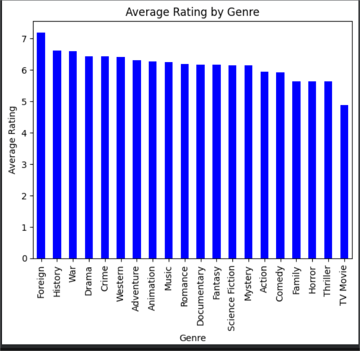

# 🎬 Movie Industry Revenue Analysis using Python

## 📖 Project Overview
This project performs Exploratory Data Analysis (EDA) on a movie industry dataset to uncover revenue trends, profitability insights, and audience behavior patterns.

The objective is to extract business-driven insights using Python data analysis libraries and visual storytelling.

---

## 🎯 Business Objectives
- Analyze revenue trends across years
- Compare budget vs revenue to evaluate ROI
- Identify most profitable genres
- Study correlation between ratings and revenue
- Detect patterns influencing movie performance

---

## 🛠 Tools & Technologies Used
- Python
- Pandas
- NumPy
- Matplotlib
- Seaborn
- Jupyter Notebook

- movie-industry-revenue-analysis-python/
│
├── data/
│   └── movies.csv
│
├── notebooks/
│   └── movie_analysis.ipynb
│
├── screenshots/
│   ├── average_rating_by_genre.png
│   ├── revenue_trend.png
│   └── heatmap.png
│
└── README.md

---

## 📊 Key Visualizations

### 📌 Average Rating by Genre

### 📌 Revenue Trend Over Years

### 📌 Correlation Heatmap

---

## 📈 Key Insights
- Certain genres consistently generate higher revenue.
- Higher budgets do not always guarantee higher profitability.
- Moderate positive correlation observed between ratings and revenue.
- Revenue trends fluctuate based on release year and genre popularity.

---

## 🚀 Business Impact
The insights derived from this analysis can help:
- Investors evaluate potential profitability
- Production houses optimize budget allocation
- Distributors identify high-performing genres
- Stakeholders understand audience preferences

---

## 👩‍💻 Author
**Your Name**  
Aspiring Data Analyst | Python | Data Visualization | Business Analytics

---

## 📂 Project Structure
